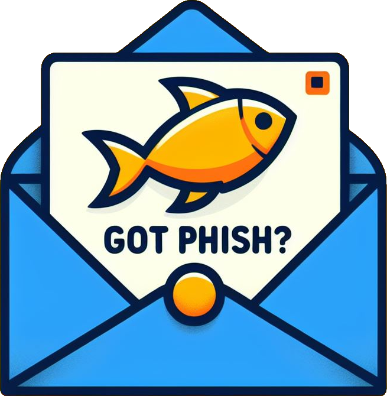
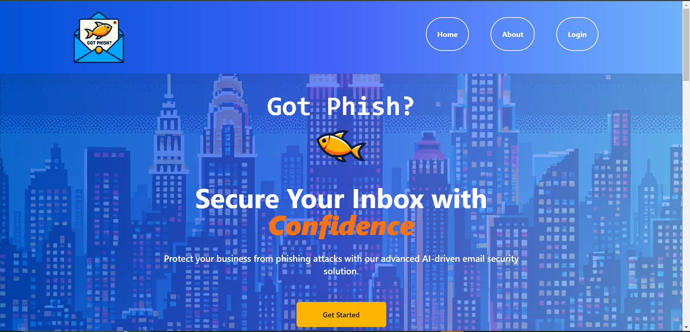
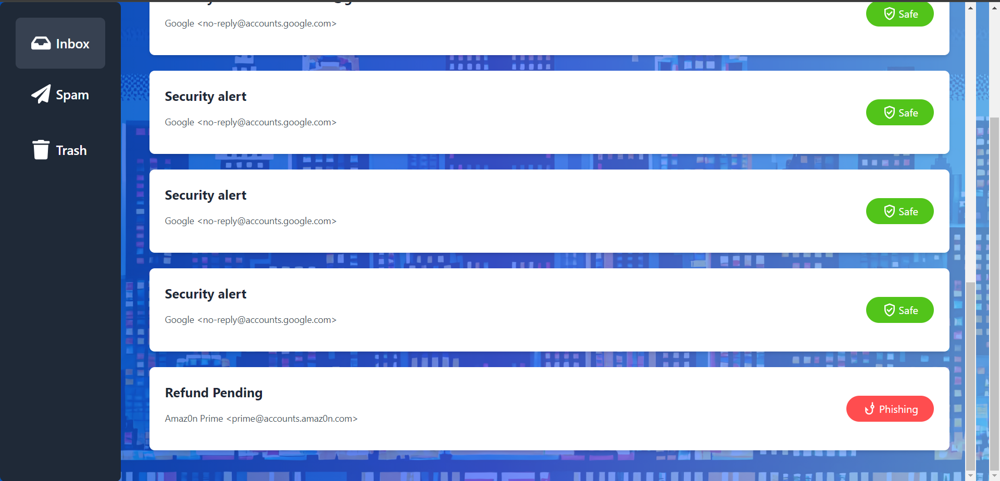

# Got Phish?


### [View on Devpost](https://devpost.com/software/got-phish)

## Secure Your Inbox with Confidence
At GotPhish, we protect your business from phishing attacks with our advanced AI-driven email security solution.

- 🎣 Tired of swimming in the sea of phishing emails? Dive into safety with Got Phish! We're your digital lifeguard, dedicated to protecting small businesses in the bustling waters of NYC from phishing threats.

- 🏖️ Log in with your Gmail, and let our AI, powered by a dataset sea, analyze your emails. We'll display a clear signal: which emails are likely safe and which ones are phishing – making your inbox a haven.

- 🌐 Utilizing the Google API for seamless email retrieval and the Cohere API for intelligent analysis, we ensure a smooth sailing experience for our users. Our backend, equipped with Kaggle's phishing dataset, dives deep into the digital waves to tag overall email safety. So, why get caught in phishing nets when you can ride the Got Phish wave?

## About The Project

### Home Page


### Login Page


### Dashboard



## Getting Started

### npm
```
npm install npm@latest -g
```

### Installation
1. Get your API keys for Google Cloud, OpenAI, Cohere, and Pinecone, then create `.env` and place them in.
2. Clone the repo.
3. `cd` into `client` dir
    ```
    npm install
    ```
4. `cd` into `server` dir, and create a new virtual environment `venv` and activate, then install all packages
    ```
    pip install -r requirements.txt
    ```
5. To start backend server, in the server dir:
    ```
    python server.py
    ```
6. To start frontend client, in the client dir:
    ```
    npm start
    ```

## Built With
- React
- Flask
- Tailwind
- OpenAI
- Cohere
- Pinecone
- Google Cloud

---
